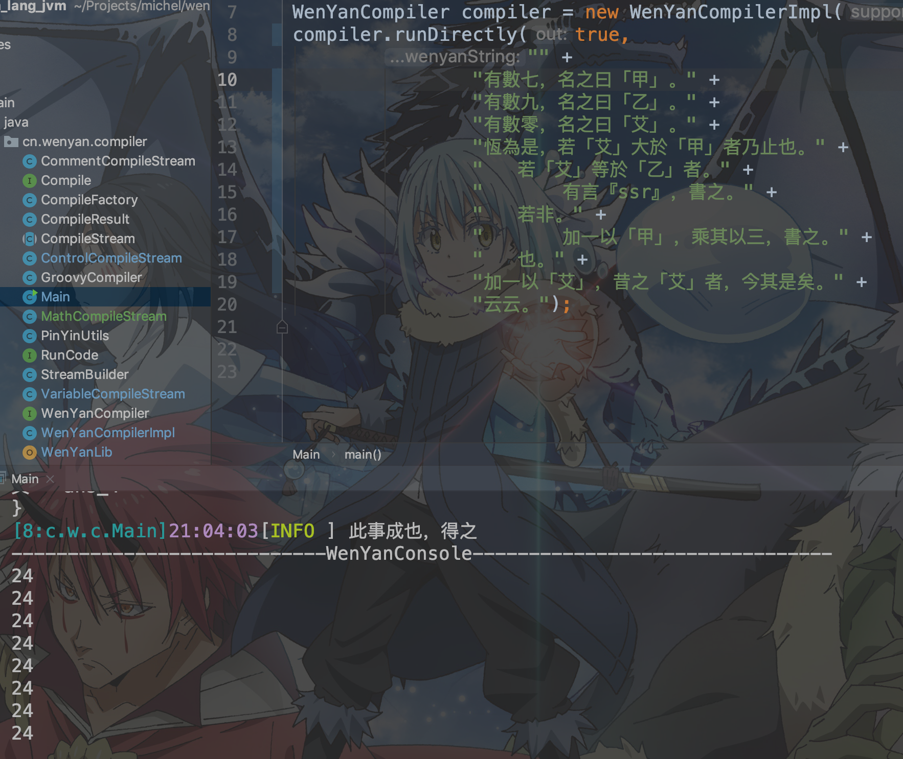

# wenyan-lang_jvm
You can run WenYan Programming Language in JVM.

> 关于作者

1. 作者由于为一高中生，技术水平有限，所以不能很快实现全部语法，并且不能非常严谨的实现，不能确保全部
来自javascript版的wenyan脚本通过编译。

2. 作者目前在 「胶南市第一高级中学」 就读。

3. 作者欢迎所有人发送pull request/issue，拒绝issue灌水和讨论语言使用性，如果有类似的issue，将
无条件关闭，不予回答

4. 由于作者尚未系统学习编译原理，没有使用抽象语法树，通过「正则」和「流程」(Stream) 完成了语言编译。

> 关于项目

语法源: https://github.com/LingDong-/wenyan-lang 

本项目的目标语言是groovy,以实现动态语言，主要是为了实现
文言lang可以调用java库或groovy库，以实现在虚拟机运行。

项目采用正则和流程进行编译，具体工作的过程是

文言语句 -> 字符串规范化 -> 断句 -> 编译流编译 -> 目标语言

编译流每编译一条语句，就会记录这个语句的指针，并且清除语句，之后把未编译语句向前推移，继续编译

直到所有语句清空为止。编译流的一次编译是一个编译的工作单元，完成了一种语句的编译。 

字符画解释:

0. 语言

`吾有一數曰四十二名之曰「運數1」吾有一數曰四十二名之曰「運數2」`

1. 断句

`吾有一數。曰四十二。名之曰「運數1」。吾有一數。曰四十二。名之曰「運數2」。`

2. 分解

`[吾有一數][曰四十二][名之曰「運數1」][吾有一數][曰四十二][名之曰「運數2」]`

3. 第一次流程编译

第一次编译完成:
` 这一块编译完成,采用了语法匹配         `
`||[吾有一數][曰四十二][名之曰「運數1」]||[吾有一數][曰四十二][名之曰「運數2」]`
`                              ^`

4. 第二次流程编译

第二次编译完成:
` 这一块编译完成,采用了语法匹配         `
`||[吾有一數][曰四十二][名之曰「運數2」]||`
`                               ^`
5. 编译完成

> 与javascript/python版本的区别

1. 这里支持了编译为groovy
2. 对于标点要求已经解决，您可以写成
```
有數七名之曰「甲」有數五名之曰「乙」有數零名之曰「艾」
```
3. 注释后面必须有标点,目前还没有解决这个问题

> 目前状态

1. 目前还在开发过程
2. 已经可以运行wenyan-lang的[图灵机](https://github.com/LingDong-/wenyan-lang/blob/master/examples/turing.wy)，图灵完备


> 目前实现的语法

##### 變量
| wenyan | groovy |
|---|---|
|`吾有一數。曰三。名之曰「甲」。` | `def jia=3` |
|`吾有一言。曰「「噫吁戲」」。名之曰「乙」。`|`def yi = '噫吁戲'`|
|`吾有一爻。曰陰。名之曰「丙」。` | `def bing = false` |
|`吾有一列。名之曰「丙」。`|`def bing = []`|
|`吾有三數。曰一。曰三。曰五。名之曰「甲」曰「乙」曰「丙」。` | `def jia = 1,yi=3,bing=5` |
|`吾有一數。曰五。書之`| `def ans_1=5 println(ans_1)`|
|`吾有一言。曰「乙」。書之`|`println(yi)`|
|`有數五十。名之曰「大衍」。`|`def dayan = 50`|
|`昔之「甲」者。今「大衍」是也。`|`jia = dayan`|

##### 数组
| wenyan | groovy|
|---|---|
|`吾有一列。名之曰「甲」。充「甲」以四。以二。`|	`def a = []; a.add(1);`|
|`夫「甲」之一。`	| `a[0]`|
|`夫「玫瑰」之「「名」」`|	`rose["name"]`|
|`夫「甲」之其餘。`|`a.slice(1)`|
##### 註釋
| wenyan | groovy |
|---|---|
|`批曰。「「文氣淋灕。字句切實」」。`|`/*文氣淋灕。字句切實*/`|
|`注曰。「「文言備矣」」。`	|`/*文言備矣*/`|
|`疏曰。「「居第一之位故稱初。以其陽爻故稱九」」。`|`/*居第一之位故稱初。以其陽爻故稱九*/`|

##### 控制
| wenyan | groovy |
|---|---|
|`為是百遍。⋯⋯ 云云。`|`for (i in 1..100){ ... }`|
|`若「甲」等於「乙」者。......也。`|`if(jia == yi){`|
|`若非。`|`}else{`|
|`恆為是。⋯⋯ 云云。`|`while (true) { ... }`|
|`乃止。`|`break`|
|`凡「天地」中之「人」。⋯⋯ 云云。`|`for (human in world){ ... }`|
##### 數學

| wenyan | groovy |
|---|---|
|`加一以二。`	|`1+2`|
|`加一於二。`|`2+1`|
|`加一以二。乘其以三。`|`(1+2)*3`|
|`除十以三。所餘幾何。`|`10%3`|
|`減七百五十六以四百三十三。名之曰「甲」。`|`def a = 756-433;`|
|`夫「甲」「乙」中有陽乎`|`a \|\| b`|
|`夫「甲」「乙」中無陰乎。`|`a&&b`|

##### 导入
| wenyan | groovy |
|---|---|
|`吾嘗觀「「群經之算經」」之書。方悟「正弦」之義。`|`import static 群经.算经.正弦`|
|`吾嘗觀「「群經之算經」」之書。`| `import 算经.群经`|

##### 函数
| wenyan | groovy |
|---|---|
|`吾有一術。名之曰「吸星大法」。是術曰。⋯⋯是謂「吸星大法」之術也。`|`def a(){...}`|
|`吾有一術。名之曰「六脈神劍」。欲行是術。必先得六數。曰「甲」。曰「乙」。曰「丙」。曰「丁」。曰「戊」。曰「己」乃行是術曰。⋯⋯是謂「六脈神劍」之術也。`|`def b(a,b,c,d,e,f){...}`|
|`施「翻倍」於「大衍」`|`b(dayuan)`|
|`施「翻倍」`|`b()`|

> 效果展示




> 特殊语法

特殊语法是本编译器独有的语法糖,有些是由于编译器实现的机制所导致的产物

本編譯器允許直接使用`書之`，可以輸出最後定義的變量

| wenyan | groovy |
|---|---|
|`有言「「好。好。」」。書之。`|`def ans_1 = '好。好。' println(ans_1)`|
|`有列空。名之曰「空也」`|`def kongYe = []`|
|调用函数时 `之: Math之pow`|`.: Math.pow`|

调用静态方法

```
吾嘗觀「「java之lang之Math」」之書。
施「Math之pow」於「大衍」於二。名之曰「矣」。書之
```

使用java对象
```
吾嘗觀「「java之lang之String」」之書。
施「new String」於「大衍」。名之曰「矣」。
施「矣之getClass」。書之。
```
> 表示法说明

1. 数字表示和原文言文项目相同
2. 字符串表示和原文言文项目相同(包括新加入的字符串)

> 如何使用

`-p` 值:true/false 是否支持拼音

`-c` 值: @MakeFile-> 批量编译文件，将文件路径一行一行的写入即可 / 一个文件名，只编译一个文件

`-o` 值: 输出文件夹的路径

`-l`  值: 编译所用lib,多个lib路径用`;`分割

`-r` 值: 运行时的参数 注意: 这个选项必须放在最后面,会将文件运行

```java
    package cn.wenyan.compiler;
    
    
    public class Main {
    
        public static void main(String[] args) {
            WenYanCompiler compiler = new WenYanCompilerImpl(false);
            compiler.runDirectly(true,
                    "" +
                            "有數七，名之曰「甲」。" +
                            "有數九，名之曰「乙」。" +
                            "有數零，名之曰「艾」。" +
                            "恆為是，若「艾」大於「甲」者乃止也。" +
                            "   若「艾」等於「乙」者。" +
                            "       有言『ssr』，書之。" +
                            "   若非。" +
                            "       加一以「甲」，乘其以三，書之。" +
                            "   也。" +
                            "   加一以「艾」，昔之「艾」者，今其是矣。" +
                            "云云。");
        }
    }

```
